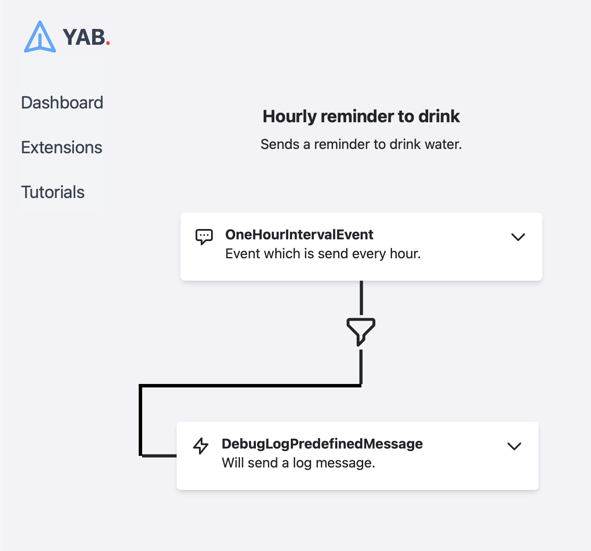
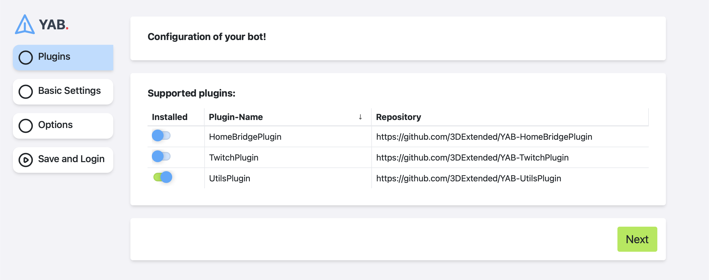
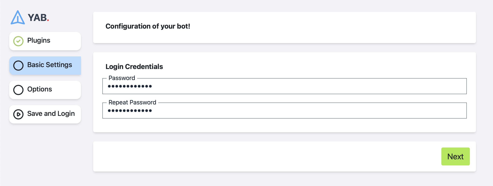
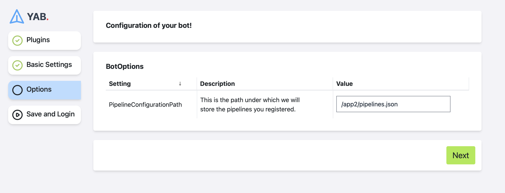

# YetAnotherBot (YAB)

## Introduction

YetAnotherBot (YAB) is a bot that can be used to automate tasks.
Plugins are used to add new functionality to YAB. Plugins can be installed at any time and allow you to connect a variety of services with another.

This combination of services allows you to automate tasks that are otherwise impossible to automate.
For example, you can use YAB to automate the process of sending a message into a discord channel when a user has subscribed on your Twitch channel.
Another example is to automate the process of turning a light on for 5 seconds when a user has send you a message on Twitter.

If you want to automate your smarthome, moderate your twitch channel, or automate your twitter feed, you can use YAB to automate your life.



## Getting Started

There are two ways to get started with YAB:

1. Using Docker
2. Building from source

After that you'll need to install the plugins you want to use.

### Using Docker

In order to host YAB on your own computer, you will need to install Docker.
There are builds for Docker for AMD64 and ARM64.

If you are interested in using YAB on a Raspberry Pi, you can use the Raspberry Pi Docker image.

To get the latest docker image, use image: `3dextended/yetanotherbot:latest`.
To get the latest docker image for raspberry pis, use image: `3dextended/yetanotherbot:latestraspberrypi`.

Once you have pulled the docker container, you can start it by running `docker run -d -p 8080:80 3dextended/yetanotherbot:latest`.

This opens a port on your computer to connect to the YAB container. You can now access the YAB web interface by going to `http://localhost:8080`.
If you are greeted with an error message, you might need to reload the tab (This only happens on the first time you start the container).

If everything worked, you are greeted with this page:



### Building from source

If you want to build YAB from source, you can following instructions.

#### Prerequisites

1. Dotnet SDK 5.0.0 or higher
2. Node v16.13.1 or higher
3. NPM v8.1.2 or higher

#### Instructions

1. Clone the repository (```git pull https://github.com/3DExtended/YetAnotherBot.git```)
2. Navigate to "/src/applications/YAB.ApiWithFrontend"
3. Run ```dotnet build```
4. Run ```dotnet run```
5. Open a browser and go to <http://localhost:5000>

I could happen that the first time you run the application, you will get an error message.
This is because the application needs to prepare the frontend for hosting. Simply reload the page and everything should be fine.

### Install Plugins

You are greeted with a list of plugins. You can install any of them by toggling the slider next to the plugin. This will internally download the latest version of that plugin. After you have selected all plugins you want to use, you have to restart the application.
After that, refresh the page and you should be able to navigate to the next page.

### Setup credentials

Your bot can hold sensitive information like your Discord token or your Twitter token.
In order to store these credentials, YAB needs to hvae a password to encrypt the data.
You can set this password on this page:



### Options

After you have set up your credentials, you can configure each plugin you have selected at the beginning. For that, each plugin has an options block in addition to the block "BotOptions".

In there, you have to configure, where the bot will store your pipelines. If you hosted the bot using Docker, please make sure to select a path under "/app2/" like "/app2/pipelines.json".
**In any case, the path should contain a filename ending with ".json".**



### Save and Login

On the last page of the setup wizard, you can save your configuration and navigate to the login screen:


## Features

- [Easy and modern Frontend](#frontend)
- [Delays of tasks](#delays)
- [Plugins](#plugins)

## Supported Plugins

Plugins are used to add new functionality to YAB. Plugins can be installed at any time and allow you to connect a variety of services with another.
YAB is a community project. I have written a lot of plugins and I hope that you will find some of them useful.

All plugins written by myself are added to the list of "supported plugins".
However, there could be plugins that are not on this list. If you want to add such a plugin, use the "Add Plugin" button in the setup process of the bot.

You can find the list of supported plugins here:
[plugins.json](plugins.json).
To learn more about a plugin, please open the repository of the plugin mentionend.

## Contributions

Contributions are welcome! If you want to contribute to YAB, simply fork the repository and make a pull request.
I will be happy to review your pull request and add it to the master branch, once it has been reviewed.

If you want to add a new plugin, you can get started by copying the [3DExtended/YAB-UtilsPlugin](https://github.com/3DExtended/YAB-UtilsPlugin) which shold be simple enough to get started creating your own plugin.

For a detailed guide on how to create a plugin, please see wiki for developers.

__One Word of Advicde__: You should create a GitHub Action for your plugin which runs periodically and verifies that the plugin is still building with the newest dev branch. If not, this could break the bot for all users currently updating their bot.

## License

[](http://creativecommons.org/licenses/by-nc-sa/4.0/)  
This work is licensed under a [Creative Commons Attribution-NonCommercial-ShareAlike 4.0 International License](http://creativecommons.org/licenses/by-nc-sa/4.0/).
The idea behind this license is to allow others to use this bot for non-commercial work. If you are interested in using this bot commercially, please contact me.
